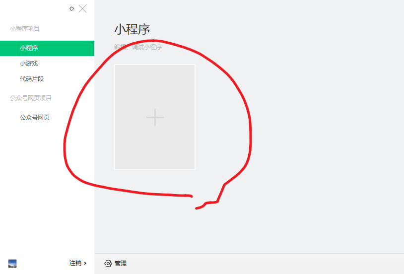

# 微信小程序

[微信小程序的官网](https://mp.weixin.qq.com/cgi-bin/wx)

微信 小 程序(网页)

你懂网页知识，你就可以开发小程序

Facebook

2017年诞生 微信用开发者工具 Node(NW.JS) 前端架构借鉴 React

支付宝

移动端的市场

组件化开发


由于JS是单线程的，网页开发渲染线程和脚本线程是互斥的
```html
<!DOCTYPE html>
<html lang="en">

<head>
    <meta charset="UTF-8">
    <meta name="viewport" content="width=device-width, initial-scale=1.0">
    <meta http-equiv="X-UA-Compatible" content="ie=edge">
    <title>Document</title>
</head>

<body>
    <script>
        alert('123')
    </script>
    <div>hello world</div>
</body>

</html>
```

逻辑层和渲染层，小程序M和V分开的，互相不干扰。

渲染层是没有DOM和BOM，它因为要让逻辑层和渲染层，改造了这个Node和Chrome，删掉了DOM和BOM，自己写了新的DOM和BOM，document和window，改造为新的全局变量wx

# 申请账号

个人账号(不要选企业账号)

# 安装开发者工具

[微信开发者工具下载地址](https://developers.weixin.qq.com/miniprogram/dev/devtools/download.html)

在工具界面里面初始化第一个小程序



AppID又企业用企业账号，帮你注册的账号开发

# 小程序代码构成

- json 配置文件
    - 根目录
        - ts.config.json       ts配置文件 [ts官网配置](http://www.typescriptlang.org/docs/handbook/tsconfig-json.html)
        - project.config.json  项目配置文件 一般用可视化面板操控里面的参数
        - miniprogram/app.json 小程序配置文件 页面的全局参数，定义路由，头部，底部，还有微信控制的一些关键的参数
        - pages/logs.json      路由组件(页面)配置文件 跟app.json改写window参数，可以实现局部控制
- 渲染层
    - wxml html语法 微信自己重写DOM和BOM
    - wxss css语法
- 逻辑层
- js   js

# 生命周期

- onLoad 监听页面加载
- onReady 监听页面初次渲染完成
- onShow 监听页面显示 程序进入后台
- onHide 监听页面隐藏 程序进入前台
- onUnload 监听页面卸载 路由和wx:if
- onPullDownRefresh 监听用户下拉动作
- onReachBottom 页面上拉触底事件的处理函数
- onShareAppMessage 用户点击右上角分享

# wxml 组件

类似html，由于小程序没有DOM和BOM，所以浏览器中所有标签都给微信改写

也叫自定义标签，称之为组件

|浏览器|微信|
|-|-|
|div|view|
|span|text|
|a|navigator 编程式导航|
|button|button|
|img|image|

常用wxml(组件)，详情看[官方组件文档](https://developers.weixin.qq.com/miniprogram/dev/component/movable-view.html)

- map
- camera
- swiper

# wxml 语法

数据绑定
```html
<!--wxml-->
<view> {{message}} </view>
<view name="{{message}}"></view>
```

列表渲染
```html
<!--wxml-->
<view wx:for="{{array}}"> {{item}} {{index}} </view>
```

条件渲染
```html
<!--wxml-->
<view wx:if="{{view == 'WEBVIEW'}}"> WEBVIEW </view>
<view wx:elif="{{view == 'APP'}}"> APP </view>
<view wx:else="{{view == 'MINA'}}"> MINA </view>
```

模板

```html
<!-- vue的写法 -->
<keep-alive>
    <Component is="xxx" />
</keep-alive>
```
模板写法跟组件很相似，现在开发中一般用自定义组件去代替
```html
<!--wxml-->
<template name="staffName">
  <view>
    FirstName: {{firstName}}, LastName: {{lastName}}
  </view>
</template>

<template is="staffName" data="{{...staffA}}"></template>
<template is="staffName" data="{{...staffB}}"></template>
<template is="staffName" data="{{...staffC}}"></template>
```

# wxss

支持大部分的css特性，多了rpx等功能

# js

事件绑定用`bindtap`
```html
<view>{{ msg }}</view>
<button bindtap="clickMe">点击我</button>
```
单向数据绑定
```js
clickMe: function() {
    this.setData({ msg: "Hello World" })
}
```
去掉了`document`和`window`，新增`wx`的接口

发送ajax
```js
wx.request({
  url: 'test.php', //仅为示例，并非真实的接口地址
  data: {
    x: '',
    y: ''
  },
  // 请求头
  header: {
    'content-type': 'application/json' // 默认值
  },
  success (res) {
    console.log(res.data)
  }
})
```
本地存储
```js
wx.setStorage({
  key:"key",
  data:"value"
})
```

# 自定义组件 Component

- 组件生命周期和页面生命周期完全不一样，生命周期用得比较少
- 跟页面不一样的是方法放在跟生命周期同级
```js
// components/Wheader/Wheader.js
Component({
  /**
   * 组件的属性列表
   */
  // 相当于 props
  properties: {

  },

  /**
   * 组件的初始数据
   */
  data: {

  },

  /**
   * 组件的方法列表
   */
  methods: {

  }
})
```
注册组件
```json
{
  "usingComponents": {
    "Wheader":"../../components/Wheader/Wheader"
  },
  "navigationBarTitleText": "我的页面",
  "navigationBarBackgroundColor": "#666666"
}
```

# vant

[vant小程序版本](https://youzan.github.io/vant-weapp/#/intro)

```bash
npm i vant-weapp -S --production
```